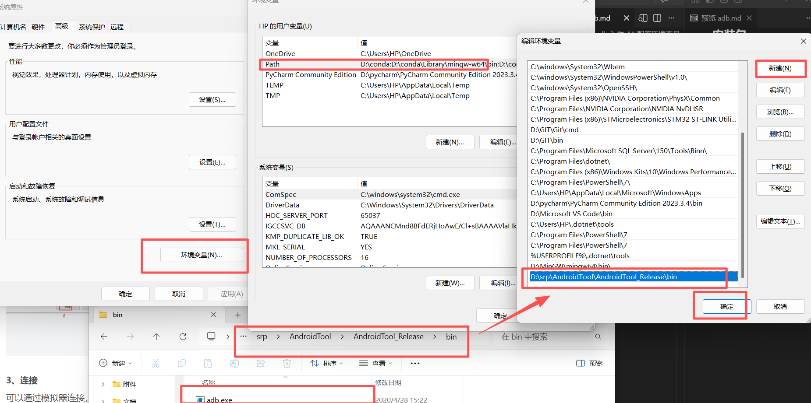
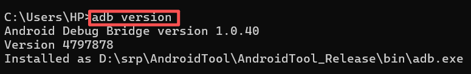
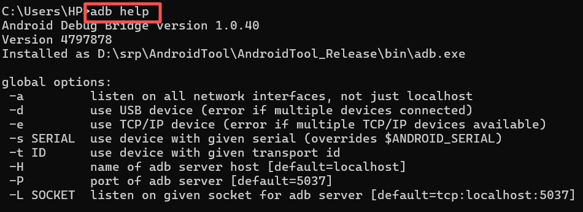
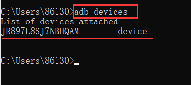
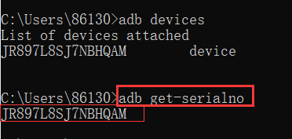
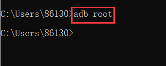
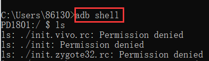
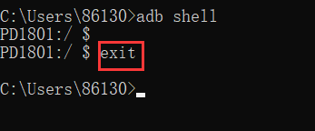
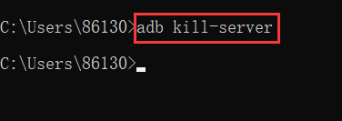
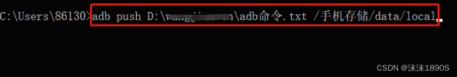

# 一、什么是adb
ADB 全称为 Android Debug Bridge，起到调试桥的作用，是一个客户端-服务器端程序。其中客户端是用来操作的电脑，服务端是 Android 设备。
# 二、安装adb
## 安装包
```shell
Windows版本：https://dl.google.com/android/repository/platform-tools-latest-windows.zip
Mac版本：https://dl.google.com/android/repository/platform-tools-latest-windows.zip
Linux版本：https://dl.google.com/android/repository/platform-tools-latest-linux.zip
```
## 配置环境变量


## 连接
usb连接
# 三、adb命令
```shell
adb version  显示adb版本
```


```shell
adb help  帮助信息，查看adb所支持的所有命令
```


```shell
adb devices   查看当前连接的设备，已连接的设备会显示出来
```


```shell
adb get-serialno  查看设备号
```


```shell
adb root  获取Android管理员的权限
```


```shell
adb shell   登录设备shell
```


```shell
exit  退出
```


```shell
adb kill-server   杀死当前adb服务
```


# 四、文件操作指令
```shell
adb push <本地路径\文件或文件夹><设备端路径>    把本地（pc机）的文件或文件夹复制到设备
```


