git # 打开git
找到要上传的文件

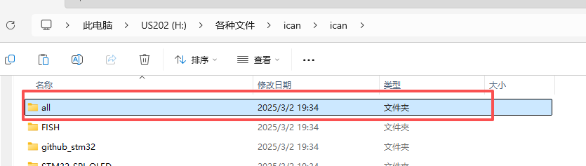

右键点更多选项

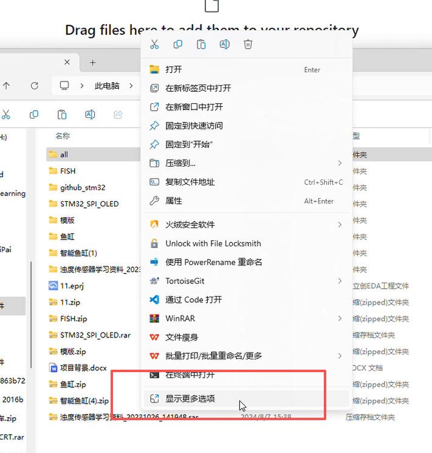

找到Open Git Bash here点击

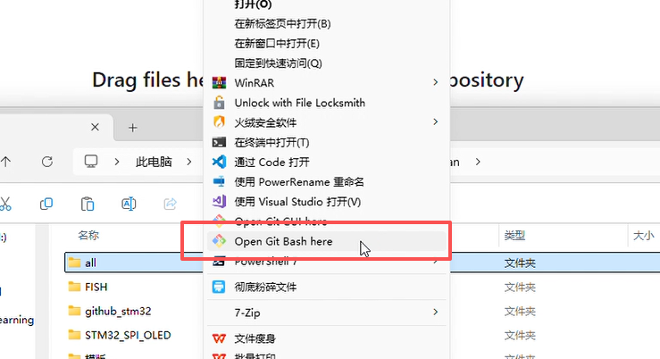

出现git终端

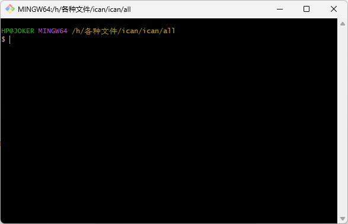

# git初始化

```shell
git init
```

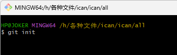

这个命令会在你的项目目录下创建一个隐藏的 .git 文件夹，标志着你的项目现在是一个 Git 仓库了。

# 添加文件到暂存区

```shell
git add *
```

 这里的“*"当前目录下的所有文件和子目录

 ## 若出现报错

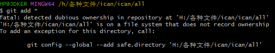

这是 Git 的安全机制（safe.directory） 在 Windows 上常见的问题。因为 H 盘文件系统不记录文件所有者（通常是 exFAT、FAT32、移动硬盘或网络盘），Git 无法判断仓库是否安全，所以阻止操作。

输入

```shell
git config --global --add safe.directory 'H:/各种文件/ican/ican/all'
```

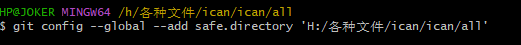

再执行

```shell
git add *
```

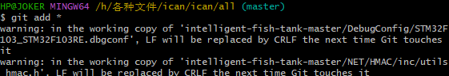

# 提交更改

 将暂存区中的文件提交到本地仓库的历史记录 中。每次提交都代表项目的一个版本。

```shell
git commit -m "Initial commit"
```
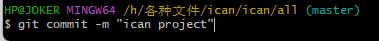

commit 是提交命令。

-m 参数后面跟着的是本次提交的说明信息。请将 "Initial commit" 替换为你本次提交的简短描述，例如 "首次提交项目代码"。

建议提交信息简明扼要，说明本次提交做了什么。

现在你的本地项目已经有了一个 Git 仓库，并且你的代码已经被添加并提交到了这个本地仓库中。

# 在github上创建一个新的空白仓库

点击页面右上角的 "+" 号，选择 "New repository"

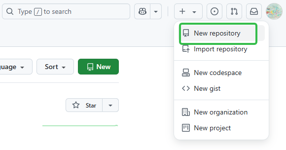

Repository name (仓库名): 给你的仓库起一个名字。这个名字通常与你的本地项目名相关，例如 AUTO-yu-Automation 或 MyAutomationScripts。

选择 Public (公开) 或 Private (私有)，根据你的需求决定。

非常重要： 不要勾选 "Add a README file", "Add .gitignore", 或 "Choose a license"。因为你已经有本地代码了，这些文件如果你需要可以在本地创建并一起上传。我们现在需要一个完全空白的仓库来接收你的本地代码。

点击绿色的 "Create repository" 按钮。

# 关联本地仓库与github上的仓库

## 复制github仓库连接

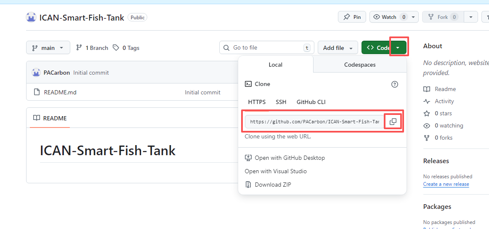

## 在git窗口输入关联命令

```shell
git remote add origin https://github.com/你的GitHub用户名/你的仓库名.git
```

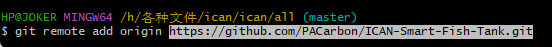

# 检查分支
如果github上的仓库是main型则输入

```shell
git branch -M main
```

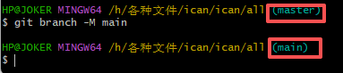

# 修改config文件（可不做，有些人在推送时可能会出现报错可以按照这个修改）

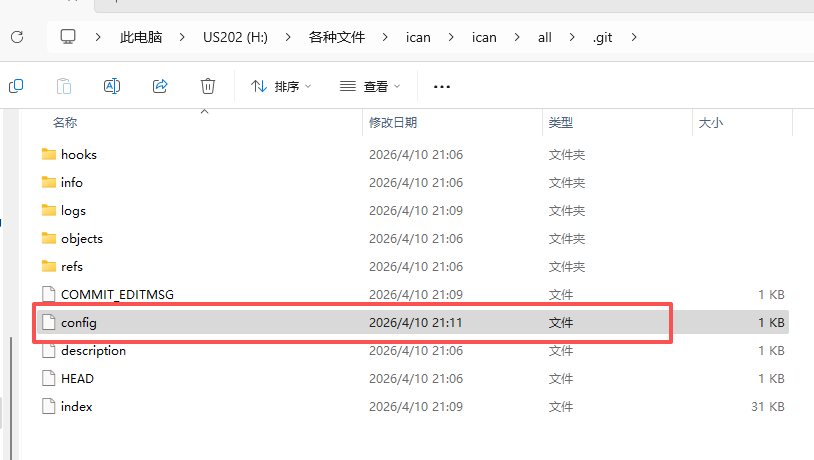

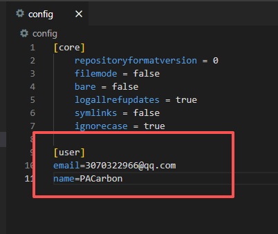

输入自己的注册github的email和名字

# 将本地文件推送

```shell
git push -u origin main
```

## 若出现报错

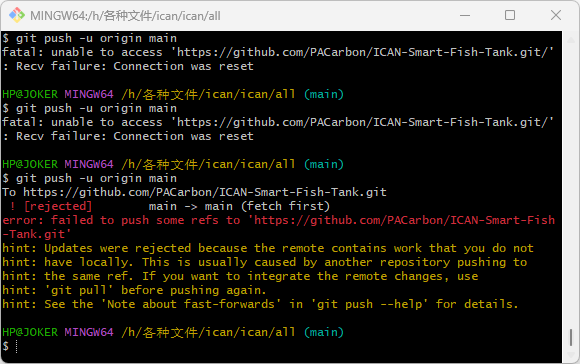

```shell
remote contains work that you do not have locally
```

常见原因是：你在 GitHub 创建仓库时勾选了 README / License / .gitignore，远程就会先有一次提交。

## 解决方案

先把远程代码拉下来再push

```shell
git pull origin main --allow-unrelated-histories
```

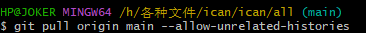

出现此界面先按esc再输入wq

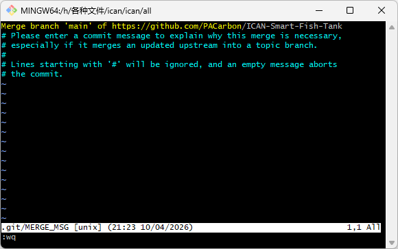

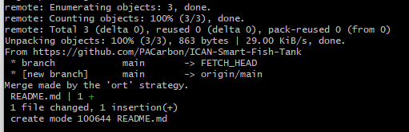

然后再push

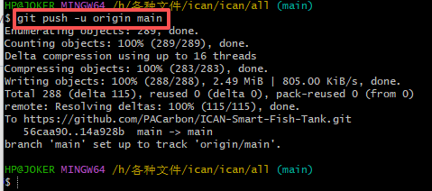


# 更新内容

## 查看文件状态

~~~
git status      //查看哪些文件发生了变化，或者是哪些文件是新增的
~~~

例如

~~~
HP@JOKER MINGW64 /d/ubuntu16.04/github (main) $ git status 
On branch main 
Your branch is up to date with 'origin/main'. 

Changes to be committed: (use "git restore --staged <file>..." to unstage) 
    new file: drawBMP/1.bmp
    new file: drawBMP/bmp 
    new file: drawBMP/drawBMP.c
    new file: mmaplcd/a 
     new file: mmaplcd/b 
    new file: mmaplcd/m 
    new file: "mmaplcd/mmaplcd\345\261\217.c" 
    deleted: note.zip
~~~

* 新增文件（new file）: drawBMP/1.bmp, drawBMP/bmp, drawBMP/drawBMP.c 等。
* 删除文件（deleted）: note.zip 被删除。

## 添加文件到暂存区

~~~
git add .
~~~

~~~
git add 文件名      //单独添加某个文件
~~~

## 提交更改

~~~
git commit -m "提交信息"
~~~

例如

~~~
git commit -m "添加了新的bmp图像文件，删除了note.zip文件"
~~~

## 推送到远程仓库

~~~
git push
~~~


