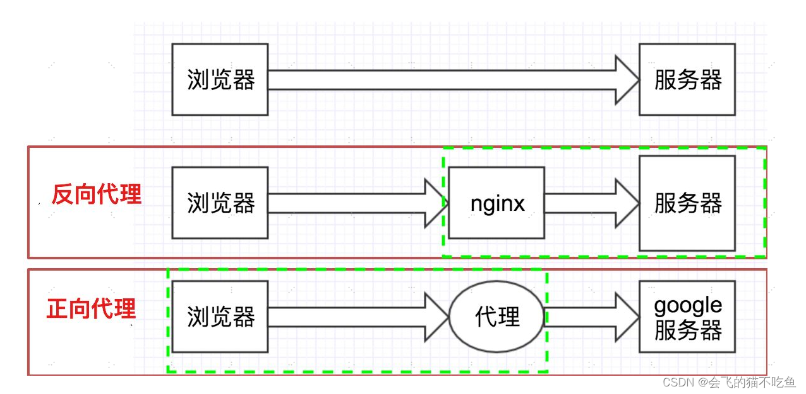

Nginx (engine x) 是一个高性能的HTTP和反向代理web服务器，同时也提供了IMAP/POP3/SMTP服务。
正向代理和反向代理

正向代理： 我们直接用国内的服务器无法访问国外的服务器，或者是访问很慢。所以我们需要在本地搭建一个服务器来帮助我们去访问。那这种就是正向代理。（浏览器中配置代理服务器）

反向代理：访问淘宝的时候，淘宝内部肯定不是只有一台服务器，它的内部有很多台服务器，那我们进行访问的时候，因为服务器中间session不共享，那我们是不是在服务器之间访问需要频繁登录，那这个时候淘宝搭建一个过渡服务器，对我们是没有任何影响的，我们是登录一次，但是访问所有，这种情况就是 反向代理。对我们来说，客户端对代理是无感知的，客户端不需要任何配置就可以访问，我们只需要把请求发送给反向代理服务器，由反向代理服务器去选择目标服务器获取数据后，再返回给客户端，此时反向代理服务器和目标服务器对外就是一个服务器，暴露的是代理服务器地址，隐藏了真实服务器的地址。（在服务器中配置代理服务器）

配置监听
nginx的配置文件是conf目录下的nginx.conf，默认配置的nginx监听的端口为80，如果80端口被占用可以修改为未被占用的端口即可。

Nginx常用命令
```shell
cd /usr/local/nginx/sbin/
./nginx  启动
./nginx -s stop  停止
./nginx -s quit  安全退出
./nginx -s reload  重新加载配置文件  如果我们修改了配置文件，就需要重新加载。
ps aux|grep nginx  查看nginx进程
```
